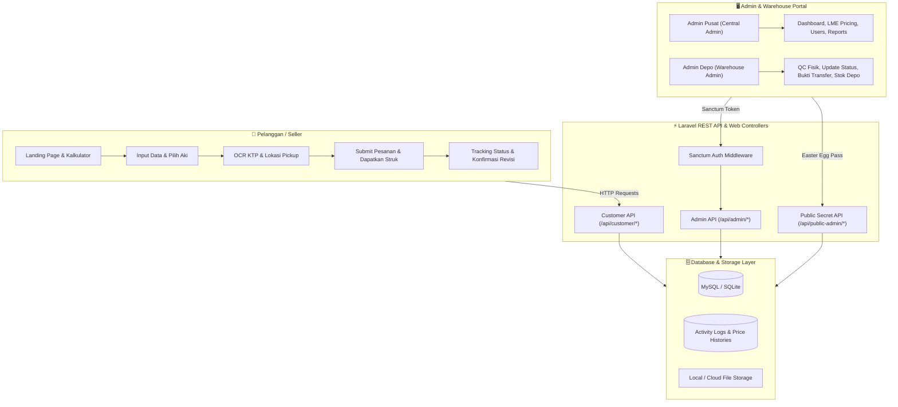

<p align="center">
  
</p>

<h1 align="center">⚡ PickUp System — Battery Trade-In & Logistics Ecosystem</h1>

<p align="center">
  <strong>Platform Terpadu Manajemen Penjemputan, Tukar Tambah, Logistik Gudang, dan Daur Ulang Aki / Baterai Bekas</strong>
</p>

<p align="center">
  <a href="#-fitur-utama"></a>
  <a href="#-fitur-utama"></a>
  <a href="#-fitur-utama"></a>
  <a href="#-fitur-utama"></a>
  <a href="#-fitur-utama"></a>
  <a href="#-fitur-utama"></a>
  <a href="#-lisensi"></a>
</p>

---

## 📖 Daftar Isi

- [Tentang Projek](#-tentang-projek)
- [Fitur Utama](#-fitur-utama)
  - [Customer / Seller Portal](#1--customer--seller-portal)
  - [Admin & Gudang Management](#2--admin--manajemen-gudang-portal)
  - [Dynamic Pricing Engine (LME & Kurs)](#3--dynamic-pricing-engine-lme--kurs)
  - [Smart Logistics & OCR AI](#4--smart-logistics--ocr-ai-verification)
- [Arsitektur & Diagram Sistem](#-arsitektur--diagram-sistem)
- [Teknologi & Dependensi](#-teknologi--dependensi)
- [Struktur Database & Model](#-struktur-database--model)
- [Daftar Endpoint API Utama](#-daftar-endpoint-api-utama)
- [Panduan Instalasi & Setup](#-panduan-instalasi--setup)
- [Akun Demo & Kredensial Default](#-akun-demo--kredensial-default)
- [Struktur Direktori Projek](#-struktur-direktori-projek)
- [Pengujian & Verifikasi (Testing)](#-pengujian--verifikasi-testing)
- [Lisensi](#-lisensi)

---

## 🚀 Tentang Projek

**PickUp System** adalah sistem backend dan antarmuka web modern berbasis **Laravel & Tailwind CSS v4** yang dirancang untuk mengelola seluruh rantai pasok daur ulang aki/baterai bekas secara terotomatisasi.

Sistem ini menghubungkan penjual (customer), depo/gudang penyimpanan kota, kurir penjemputan, hingga manajemen pusat dengan alur kerja yang transparan, perhitungan harga dinamis berbasis bursa logam internasional (**London Metal Exchange / LME**), estimasi ongkir pintar, serta verifikasi identitas berbasis **Optical Character Recognition (OCR)**.

> [!NOTE]
> Proyek ini siap digunakan pada server lokal (**Laragon, XAMPP, Nginx**) maupun serverless environment (**Vercel**) melalui modul *bridge adapter* `api_core/index.php`.

---

## ✨ Fitur Utama

### 1. 🛍️ Customer / Seller Portal
- **Kalkulator & Estimator Harga Real-Time**: Simulasi harga aki bekas langsung berdasarkan jenis aki, brand (GS Astra, Yuasa, Incoe, dll), dan kota pengambilan.
- **Tukar Tambah (Trade-In) & Direct Sale**: Pilihan menjual aki bekas untuk dicairkan dana atau ditukar tambah dengan aki baru.
- **Formulir Transaksi Multi-Step**:
  1. *Pilihan Aki & Jumlah* (bisa multi-tipe sekaligus).
  2. *Identitas & Rekening* (Nama, No. HP, Bank tujuan transfer, Nomor rekening).
  3. *Metode Pengiriman*: Antar mandiri ke Depo terdekat (**Drop-off**) atau Dijemput ke rumah (**Pick-Up**).
  4. *Kalkulasi Jarak & Ongkir Otomatis*: Geocoding jarak pengguna ke gudang terdekat dengan rumus dinamis.
- **Struk Digital & Pelacakan Transaksi (Digital Receipt)**: Pelacakan status real-time (`Menunggu`, `Dijemput`, `Tiba di Gudang`, `Transfer Berhasil`, `Selesai`, `Dibatalkan`).
- **Konfirmasi Revisi QC (User Edit Confirmation)**: Jika fisik aki yang diterima gudang berbeda dengan yang diinputkan pelanggan, pelanggan dapat mengonfirmasi atau menolak penyesuaian sebelum pembayaran ditransfer.

### 2. 🛡️ Admin & Manajemen Gudang Portal
- **Dashboard Statistik & KPI Interaktif**: Grafik omset, total transaksi, total berat timbal aki (kg), pesanan pending, dan status stok.
- **Manajemen Pesanan & QC Fisik**:
  - Validasi fisik aki, berat riil, dan penyesuaian harga (QC Adjustment).
  - Unggah bukti transfer & foto serah terima gudang.
  - Pelabelan pelanggan bermasalah (*Customer Flagging*).
- **Manajemen Multi-Depo & Stok Gudang (Warehouse Storage)**:
  - Pelacakan stok aki per depo kota (DEP Jakarta, DEP Bandung, DEP Surabaya, MMM Banyuwangi, dll).
  - Fitur **Batch Central Pick-Up**: Menandai pengiriman stok aki terkumpul dari depo regional menuju gudang pusat.
  - Soft-delete & Restore depo/gudang.
- **Activity Log & Audit Trail**: Pencatatan riwayat aktivitas operasional admin secara mendetail (perubahan status, update harga, revisi pesanan, dll).
- **Manajemen Pengguna & Hak Akses Berjenjang**:
  - `Admin Pusat` (Central Admin): Akses penuh ke seluruh data nasional, pengaturan LME, harga pengiriman, dan user admin.
  - `Admin Gudang` (Warehouse Admin): Akses terfokus pada transaksi dan stok gudang/depo wilayah masing-masing.
- **Laporan & Export Data**: Filter laporan berdasarkan rentang tanggal, status pesanan, kota, brand, dan gudang penyimpanan.

### 3. 📈 Dynamic Pricing Engine (LME & Kurs)
- **Kalkulasi Otomatis Berbasis Indeks Global**:
  $$\text{Harga Dasar} = \text{Berat Kering (kg)} \times \text{LME (USD/Ton)} \times \text{Kurs (IDR/USD)} \times \text{Index Global}$$
- **Persentase Wilayah Per Kota**: Fleksibilitas margin harga per kota (misal Jakarta 82.5%, Bandung 87.5%, Yogyakarta 90%).
- **Audit & Timeline Riwayat Harga**: Jejak rekaman histori perubahan harga aki untuk keperluan akuntansi dan audit.

### 4. 🚚 Smart Logistics & OCR AI Verification
- **Logistics Pricing Setting**:
  - Pengaturan biaya jemput dasar (*Base Fee*), tarif per kilometer (*Distance Rate*), waktu tempuh (*Time Rate*), batas gratis ongkir (*Free Distance / Min Battery threshold*), dan pengali biaya.
  - Riwayat penyesuaian tarif pengiriman (*Pickup Pricing History*).
- **OCR Smart Verification**:
  - Ekstraksi otomatis nama pada foto KTP pelanggan.
  - Verifikasi otomatis kesesuaian nama rekening tujuan pada bukti pembayaran / slip transfer.
- **Easter Egg Secret Protection**: Akses proteksi ganda dengan kata sandi rahasia (`X-Easter-Egg-Pass`) untuk halaman sensitif (Manajemen User & Penyesuaian Tarif Penjemputan).

---

## 🏛️ Arsitektur & Diagram Sistem



---

## 🛠️ Teknologi & Dependensi

| Layer | Teknologi / Library | Keterangan |
|---|---|---|
| **Backend Framework** | Laravel 12 / 13 | Arsitektur MVC & REST API modern |
| **Bahasa Pemrograman** | PHP 8.3+ | Fitur type safety & performa tinggi |
| **Authentication** | Laravel Sanctum | Token-based API Authentication |
| **Frontend Template** | Blade & Vanilla JS | Ringan, responsif, tanpa overhead SPA |
| **Styling** | Tailwind CSS v4.0 | Utilitas CSS modern dan dinamis |
| **Asset Bundler** | Vite 8.0 | Hot-Module Replacement super cepat |
| **Database** | MySQL 8.0 / SQLite | Relational database dengan 30+ migrasi |
| **Testing** | PHPUnit 12 | Automated Feature & Unit Testing |
| **Serverless Ready** | Vercel Serverless PHP | Terintegrasi via adapter `api_core` |

---

## 🗃️ Struktur Database & Model

Aplikasi didukung oleh 19 model Eloquent yang saling berelasi:

| Model | Tabel Database | Deskripsi Fungsi |
|---|---|---|
| [`User`](app/Models/User.php) | `users` | Akun staf admin (role: `central` atau `warehouse`). |
| [`Customer`](app/Models/Customer.php) | `customers` | Data pemilik/penjual aki (nama, kontak, KTP, no rekening, bank, flag status). |
| [`Order`](app/Models/Order.php) | `orders` | Data transaksi pesanan penjemputan/tukar tambah, alamat, metode delivery, dan status. |
| [`Receipt`](app/Models/Receipt.php) | `receipts` | Struk bukti transaksi, nomor nota, konfirmasi revisi, total nilai. |
| [`Accu`](app/Models/Accu.php) | `accus` | Master jenis aki bekas (nama, brand, berat kering timbal). |
| [`NewAccu`](app/Models/NewAccu.php) | `new_accus` | Master tipe aki baru untuk program tukar tambah. |
| [`Brand`](app/Models/Brand.php) | `brands` | Merk aki (GS Astra, Yuasa, Incoe, Delkor, Amaron, Bosch, dll). |
| [`City`](app/Models/City.php) | `cities` | Master kota operasional beserta persentase harga regional. |
| [`Warehouse`](app/Models/Warehouse.php) | `storages` | Depo/gudang penampungan kota (Jakarta, Bandung, Surabaya, Banyuwangi, dll). |
| [`Shipment`](app/Models/Shipment.php) | `shipments` | Pencatatan ekspedisi/pickup aki dari customer ke gudang. |
| [`Transfer`](app/Models/Transfer.php) | `transfers` | Pembayaran transfer bank ke customer beserta lampiran bukti transfer. |
| [`Setting`](app/Models/Setting.php) | `settings` | Parameter global: Indeks LME ($/ton) dan Nilai Kurs USD/IDR. |
| [`PriceHistory`](app/Models/PriceHistory.php) | `price_histories` | Log historis fluktuasi perubahan harga aki. |
| [`PickupPricingSetting`](app/Models/PickupPricingSetting.php) | `pickup_pricing_settings` | Parameter algoritma ongkos kirim/penjemputan. |
| [`PickupPricingHistory`](app/Models/PickupPricingHistory.php) | `pickup_pricing_histories` | Histori audit perubahan tarif penjemputan. |
| [`OrderPickupPricing`](app/Models/OrderPickupPricing.php) | `order_pickup_pricings` | Snapshot rincian ongkos kirim spesifik per order. |
| [`PaymentMethod`](app/Models/PaymentMethod.php) | `payment_methods` | Pilihan metode pencairan dana bagi customer. |
| [`Bank`](app/Models/Bank.php) | `banks` | Daftar bank tujuan transfer (BCA, Mandiri, BNI, BRI, dll). |
| [`Activity`](app/Models/Activity.php) | `activities` | Log jejak audit aksi operasional sistem admin. |

---

## 📡 Daftar Endpoint API Utama

### 1. Customer Endpoints (Public)
| Method | Endpoint | Deskripsi |
|---|---|---|
| `GET` | `/api/customer/cities` | Mengambil daftar kota operasional |
| `GET` | `/api/customer/cities/{cityId}/accus` | Mengambil daftar harga aki bekas berdasarkan kota |
| `GET` | `/api/customer/new-accus` | Mengambil daftar katalog aki baru untuk tukar tambah |
| `GET` | `/api/customer/storages` | Mengambil daftar depo/gudang terdekat |
| `GET` | `/api/customer/banks` | Mengambil daftar opsi bank pembayaran |
| `POST` | `/api/customer/calculate-pickup-fee` | Menghitung simulasi ongkos kirim berdasarkan koordinat |
| `POST` | `/api/customer/orders` | Membuat pesanan penjemputan / tukar tambah baru |
| `GET` | `/api/customer/orders/{id}` | Melihat rincian pesanan pelanggan |
| `GET` | `/api/customer/receipts/{orderId}` | Mengambil detail struk digital transaksi |
| `POST` | `/api/customer/orders/{id}/confirm-edit` | Konfirmasi atau tolak revisi QC fisik dari admin |
| `POST` | `/api/customer/ocr/extract-name` | Ekstraksi nama dari foto identitas (KTP) |
| `POST` | `/api/customer/ocr/verify-proof` | Verifikasi OCR bukti pembayaran |

### 2. Admin Authentication & Core Endpoints (Protected by Sanctum)
| Method | Endpoint | Deskripsi |
|---|---|---|
| `POST` | `/api/login` | Login admin (mendapatkan Sanctum Bearer Token) |
| `POST` | `/api/logout` | Logout admin & revocasi token |
| `GET` | `/api/admin/dashboard-stats` | Ringkasan statistik & KPI performa operasional |
| `GET` | `/api/admin/reports` | Mengunduh & memfilter laporan transaksi |
| `GET/POST` | `/api/admin/orders` | Menampilkan dan memproses antrean transaksi |
| `PUT` | `/api/admin/orders/{id}/status` | Mengubah status transaksi pesanan |
| `PUT` | `/api/admin/orders/{id}/items` | Revisi fisik/jumlah aki setelah pemeriksaan QC |
| `GET/POST` | `/api/admin/prices` | Mengatur parameter LME, Kurs, dan harga aki |
| `GET` | `/api/admin/storages/{id}/stock` | Ringkasan stok aki riil per gudang/depo |
| `POST` | `/api/admin/storages/{id}/pickup` | Batch transfer stok depo menuju gudang pusat |
| `GET/PUT` | `/api/admin/pengiriman` | Mengelola formula tarif penjemputan kurir |
| `GET/DELETE`| `/api/admin/activities` | Membaca & membersihkan catatan log aktivitas admin |

---

## 💻 Panduan Instalasi & Setup

Ikuti langkah-langkah berikut untuk menjalankan proyek di lingkungan pengembangan lokal:

### 1. Prasyarat Sistem
- **PHP** $\ge$ 8.3 dengan ekstensi: `pdo`, `pdo_mysql` / `pdo_sqlite`, `mbstring`, `bcmath`, `curl`, `gd`
- **Composer** $\ge$ 2.x
- **Node.js** $\ge$ 20.x & **NPM**
- **MySQL** atau **SQLite**

### 2. Clone Repositori
```bash
git clone https://github.com/username/PickUpSystem.git
cd PickUpSystem
```

### 3. Instal Dependensi Backend & Frontend
```bash
# Instal dependensi PHP
composer install

# Instal dependensi JavaScript & CSS
npm install
```

### 4. Konfigurasi File Environment (.env)
Salin berkas `.env.example` menjadi `.env`:
```bash
cp .env.example .env
```

Sesuaikan konfigurasi database pada `.env`:
```env
APP_NAME="PickUp System"
APP_ENV=local
APP_KEY=
APP_DEBUG=true
APP_URL=http://localhost:8000

DB_CONNECTION=mysql
DB_HOST=127.0.0.1
DB_PORT=3306
DB_DATABASE=pickup_system
DB_USERNAME=root
DB_PASSWORD=
```

Generate application key:
```bash
php artisan key:generate
```

### 5. Jalankan Migrasi & Database Seeder
Jalankan migrasi tabel lengkap beserta dummy data transaksi riil:
```bash
php artisan migrate:fresh --seed
```

> [!TIP]
> Seeder akan otomatis mengisi:
> - Master data kota, brand, 50+ varian tipe aki, depo gudang, bank, metode bayar.
> - Lebih dari **2.500+ riwayat transaksi realistis**, struk, shipment, dan transfer.
> - Akun admin pusat dan admin gudang kota.

### 6. Menjalankan Server Pengembangan
Gunakan perintah serentak (Vite + Laravel Server):
```bash
# Opsi 1: Menjalankan via composer script
composer run dev

# Opsi 2: Menjalankan secara terpisah di 2 terminal
php artisan serve
npm run dev
```

Buka peramban (browser) di:
- **Portal Pelanggan**: [`http://localhost:8000/`](http://localhost:8000/)
- **Portal Admin**: [`http://localhost:8000/admin`](http://localhost:8000/admin)

---

## 🔑 Akun Demo & Kredensial Default

Setelah menjalankan `DatabaseSeeder`, Anda dapat login menggunakan akun berikut:

### 👑 Admin Pusat (Central Admin)
- **Username**: `Admin Test` atau `Admin Utama`
- **Email**: `admin.test@example.com`
- **Password**: `password123`
- **Hak Akses**: Seluruh modul, audit LME, user management, dan laporan keuangan nasional.

### 🏭 Admin Gudang / Depo Regional
| Wilayah Depo | Username | Email | Password |
|---|---|---|---|
| **DEP Jakarta** | `admin.depjakarta` / `Budi Staf Admin` | `budi.admin@example.com` | `password123` |
| **DEP Surabaya** | `admin.depsurabaya` / `Siti Ops Surabaya` | `siti.surabaya@example.com` | `password123` |
| **DEP Bandung** | `admin.depbandung` / `Dedi Ops Bandung` | `dedi.bandung@example.com` | `password123` |
| **MMM Banyuwangi** | `admin.mmmbanyuwangi` | `admin.mmmbanyuwangi@example.com` | `password123` |

### 🗝️ Password Rahasia (Easter Egg Secret Gate)
- **Akses Pengguna**: `aadu_imli`
- **Akses Pengiriman / Ongkir**: `jojo_ganteng`

---

## 📂 Struktur Direktori Projek

```text
PickUpSystem/
├── api_core/                  # Bridge adapter routing untuk serverless / Vercel
├── app/
│   ├── Http/
│   │   ├── Controllers/
│   │   │   └── Api/
│   │   │       ├── Admin/     # Controller modul Admin (Order, Price, Stock, dll)
│   │   │       ├── Customer/  # Controller modul Customer (Order, OCR, Receipt, dll)
│   │   │       └── AuthController.php
│   │   └── Requests/Admin/    # Form request validation rules
│   └── Models/                # 19 Eloquent Models & relasi database
├── database/
│   ├── migrations/            # 30+ skema migrasi database
│   └── seeders/               # Master seeder (LME, Kota, Aki, Transaksi, Admin)
├── resources/
│   ├── css/                   # Tailwind CSS v4 source styles
│   ├── js/                    # Client-side scripts & OCR integrations
│   └── views/
│       ├── admin/             # Tampilan panel admin (Dashboard, Pesanan, Gudang, dll)
│       ├── user/              # Tampilan portal pelanggan (Landing, Identity, Receipt)
│       └── layouts/           # Master layout blade
├── routes/
│   ├── api.php                # Rute REST API publik & protected Sanctum
│   └── web.php                # Rute web interface
├── tests/
│   └── Feature/               # Automated feature tests (Pricing, Auth, Seeders)
└── vite.config.js             # Konfigurasi Vite & Tailwind CSS
```

---

## 🧪 Pengujian & Verifikasi (Testing)

Aplikasi dilengkapi pengujian otomatis dengan PHPUnit untuk memastikan integritas fitur penetapan harga, relasi seeder, dan alur API:

```bash
# Menjalankan seluruh test suite
php artisan test

# Atau menggunakan composer test script
composer run test
```

Contoh keluaran pengujian:
```text
   PASS  Tests\Feature\ExampleTest
  ✓ it returns a successful response

   PASS  Tests\Feature\AdminPickupPricingTest
  ✓ index returns current setting and history
  ✓ update modifies settings and records history
  ✓ update rejects invalid multipliers

   PASS  Tests\Feature\PickUpSystemSeederTest
  ✓ seeder populates core tables correctly

  Tests:    12 passed (28 assertions)
  Duration: 0.85s
```

---

## 📄 Lisensi

Projek **PickUp System** ini dirilis di bawah lisensi open-source [MIT License](LICENSE).

<p align="center">
  Dibuat dengan ❤️ untuk efisiensi rantai pasok dan ekosistem daur ulang energi hijau.
</p>
